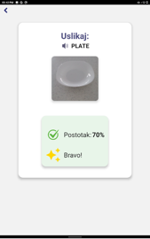
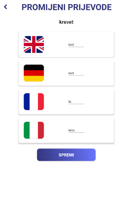

# Scanny

**Scanny** is an educational mobile application that leverages real-time object detection and image classification to turn language learning for elementary students into an interactive game. 
Point your camera at everyday items to get instant translations, then reinforce your vocabulary through gamified quizzes—photograph the specified objects in the target language and have your responses automatically evaluated.

---

## 🚀 Features

- **Real-time Object Detection**  
  Uses TensorFlow & Vision AI to recognize everyday objects through the camera feed.  
- **Instant Translation**  
  On-device ML Kit translations (Kotlin/Android) provide immediate vocabulary support.  
- **Gamified Quizzes**  
  Students complete challenges by photographing target-language items; answers are auto-scored.  
- **Lecture & Vocabulary Management**  
  Teachers can create lectures, scan vocabulary items, and edit translations.  
- **Persistent Backend**  
  Spring Boot + PostgreSQL stores lectures, questions, and user progress.  
- **Containerized Deployment**  
  Dockerized backend for easy setup and scaling.

---

## 💻 Tech Stack

- **Mobile**: Kotlin • Android Studio • ML Kit Translate  
- **Backend**: Spring Boot • Jackson • Jakarta • Hilt  
- **Database**: PostgreSQL  
- **Containerization**: Docker • Docker Compose  
- **AI/ML**: TensorFlow Lite • Google Vision AI

---

## 🛠️ Prerequisites

- **Android Studio** (Arctic Fox or later)  
- **JDK 11+**  
- **Docker & Docker Compose**  
- **PostgreSQL** (or let Docker Compose bring it up)  

---
## 📱 Screenshots

<table>
  <tr>
    <td></td>
    <td></td>
    <td></td>
    <td></td>
  </tr>
  <tr>
    <td></td>
    <td></td>
    <td></td>
    <td></td>
  </tr>
  <tr>
    <td></td>
  </tr>
</table>

